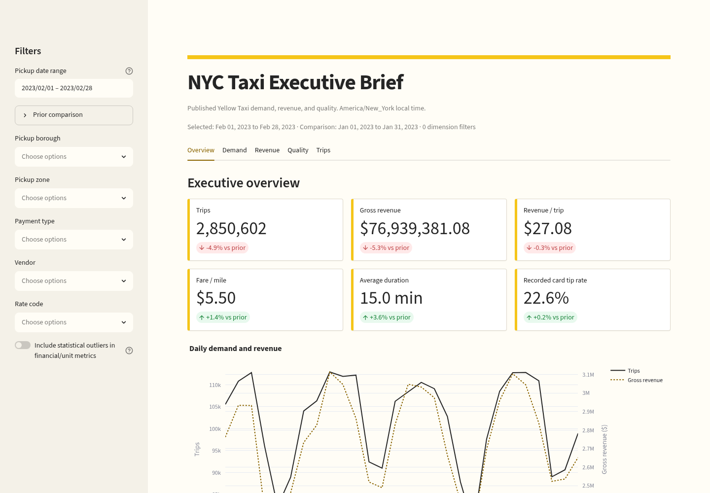
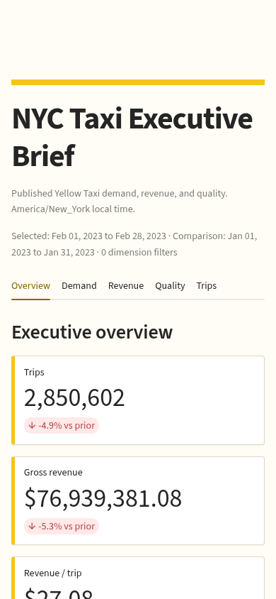

# Assignment 1: NYC Yellow Taxi Batch ETL

Local automated batch pipeline for January and February 2023 NYC Yellow Taxi data. Apache Airflow executes Python/Polars ETL, PostgreSQL stores a dimensional model, and Streamlit presents demand, revenue, trip, and quality metrics.

## Run It

From this directory:

```bash
bash ./setup.sh --local-demo
```

The command:

1. validates the Linux/Docker host;
2. downloads a checksum-verified pinned `uv` binary;
3. installs repo-local Python 3.12 and a `.venv`;
4. starts PostgreSQL with Docker Compose;
5. downloads January and February 2023 with `curl` using atomic `.part` files;
6. applies Alembic migrations;
7. executes both monthly runs through the `taxi_monthly_etl` Airflow DAG;
8. verifies both fact partitions, zone keys, and dashboard aggregate totals;
9. serves Streamlit at <http://localhost:8501>.

First run: usually 10-20 minutes depending on network, CPU, and disk. Keep the terminal open while using Streamlit. Press `Ctrl-C` to stop Streamlit; PostgreSQL remains available for inspection.

```bash
bash ./teardown.sh --local
```

This stops local containers but preserves the PostgreSQL volume. See [`docs/demo-runbook.md`](docs/demo-runbook.md) for inspection and reset commands.

## Host Prerequisites

Setup is distribution-neutral: it detects dependencies but never invokes `sudo`, `apt`, `dnf`, `yum`, `pacman`, `zypper`, `xbps`, or `apk`.

| Requirement | Notes |
|---|---|
| glibc Linux x86_64/aarch64 or WSL2 | Automatic bootstrap does not support Alpine/musl |
| Bash 4+ | Run scripts with `bash` after ZIP extraction |
| Docker Engine/Desktop | Daemon must be running and usable by the current user |
| Docker Compose v2 | `docker compose version` must succeed |
| `curl`, current CA certificates, `openssl` | HTTPS downloads and generated local secrets |
| GNU-compatible `tar`, `gzip`, `sha256sum`, `awk`, `grep`, `find`, `install`, `df`, `dd`, `tail`, `tee` | Checked before setup mutates local state |
| Outbound HTTPS/DNS | GitHub Releases, Python package indexes, Docker registry, TLC CloudFront |
| 4 GiB RAM minimum | 6-8 GiB preferred; months execute sequentially |
| 5 GiB free disk minimum | Includes Python, Docker image, data, PostgreSQL, and logs |
| Ports 5432 and 8501 | PostgreSQL and Streamlit |

Docker installation, daemon startup, Docker socket permissions, corporate proxy/private CA setup, firewall policy, and WSL2 integration are host-administrator decisions and cannot be safely automated by `setup.sh`. Use the official Docker instructions for the evaluator's distribution.

## Expected Results

Validated official TLC source results:

| Month | Source | Accepted | Rejected | Flagged | SHA-256 |
|---|---:|---:|---:|---:|---|
| 2023-01 | 3,066,766 | 2,998,637 | 68,129 | 75,415 | `32df6f67578fa86c484a6b5ef23a5281992ff085521082340b0f9e5889e9a572` |
| 2023-02 | 2,913,955 | 2,850,602 | 63,353 | 82,782 | `4809e6aaac64f05a62d16a25d55713be1537ad64fc261e895eaf2d2120fe750a` |
| **Total** | **5,980,721** | **5,849,239** | **131,482** | **158,197** | |

The loader replaces month partitions atomically. Immediate reruns preserve fact counts, source hashes, zero source duplicates, zone mappings, and quality totals.

## Dashboard





The single Streamlit application contains Overview, Demand, Revenue, Quality, and Trips tabs. It uses an aggregate mart for bounded queries and a read-only keyset-paginated trip explorer.

## Requirement Evidence

| Assessment requirement | Implementation | Proof |
|---|---|---|
| Bash setup, virtual environment, dependencies, Docker PostgreSQL, two `curl` downloads | `setup.sh --local-demo`, `scripts/local-demo.sh`, `scripts/download-sources.sh` | Clean E2E command above |
| `schema.sql`, central fact, at least three dimensions | `sql/schema.sql`: fact plus date, time, zone, payment, vendor, and rate dimensions | Integration FK/partition tests |
| Modern open-source orchestration | Apache Airflow DAG `taxi_monthly_etl` | Local Airflow `dags test` runs for both months |
| Python extract, clean, transform, load | `src/nyc_taxi_etl/` with Polars and psycopg COPY | Real row reconciliation and database assertions |
| Structured start/end logging, row counts, explicit errors | JSON `pipeline_started`, `pipeline_completed`, `pipeline_failed` events | `.local/logs/airflow-YYYY-MM.log` |
| Orchestrator logs failures | Airflow task state/logging plus `notify_failure`; controlled failure DAG | Failure command in demo runbook |
| Average fare per mile | `sql/queries/average_fare_per_mile.sql` | Executed in demo runbook and integration tests |
| Peak ride hours | `sql/queries/peak_ride_hours.sql` | Executed in demo runbook and integration tests |
| Revenue by payment type | `sql/queries/revenue_by_payment_type.sql` | Executed in demo runbook and integration tests |
| Single-page Streamlit dashboard | `dashboard/app.py` | Live AppTest, desktop/mobile screenshots |

Full retained proof: [`docs/evidence/release-v0.1.0.md`](docs/evidence/release-v0.1.0.md).

## Validate

```bash
VERIFY_IMAGES=false ./scripts/verify.sh
```

This runs dependency-lock validation, Ruff, formatting, mypy, Alembic on disposable PostgreSQL, pytest with branch coverage (minimum 85%), lifecycle shell tests, SQLFluff, and Compose validation.

For a clean non-interactive evaluator run without leaving Streamlit in the foreground:

```bash
bash ./setup.sh --local-demo --no-dashboard
```

## Architecture

```text
TLC Parquet (2023-01, 2023-02)
              |
              v
Apache Airflow DAG -> Python/Polars validation -> rejected Parquet quarantine
              |                    |
              |                    v
              +----------> PostgreSQL star schema
                                      |
                                      v
                              analytics mart
                                      |
                                      v
                            Streamlit dashboard
```

Detailed model: [`docs/data-model.md`](docs/data-model.md). Architecture: [`docs/architecture.md`](docs/architecture.md).

## Assumptions

- Source months: January-February 2023, downloaded from official TLC CloudFront URLs.
- Average fare per mile is `SUM(fare_amount) / SUM(trip_distance)`.
- Revenue is summed `total_amount` for hard-valid, non-refund rows.
- The required total-revenue query includes every accepted row. Dashboard unit metrics can exclude statistical outliers; demand counts always retain accepted rows.
- Peak hour uses pickup count by America/New_York wall-clock hour.
- Local Airflow uses `SequentialExecutor` to fit evaluator hardware. KubernetesExecutor is an optional extended platform, not required for the one-command assessment demo.
- Synthetic fixture data is test-only unless official source download fails and fallback is explicitly requested.

## Optional Extended Platform

`infra/local/`, `infra/aws/`, OIDC, MinIO, Kubernetes, Prometheus/Grafana/Loki, backup/restore, and AWS Terraform demonstrate production design. They are not prerequisites for the reliable fresh-machine assessment path.
